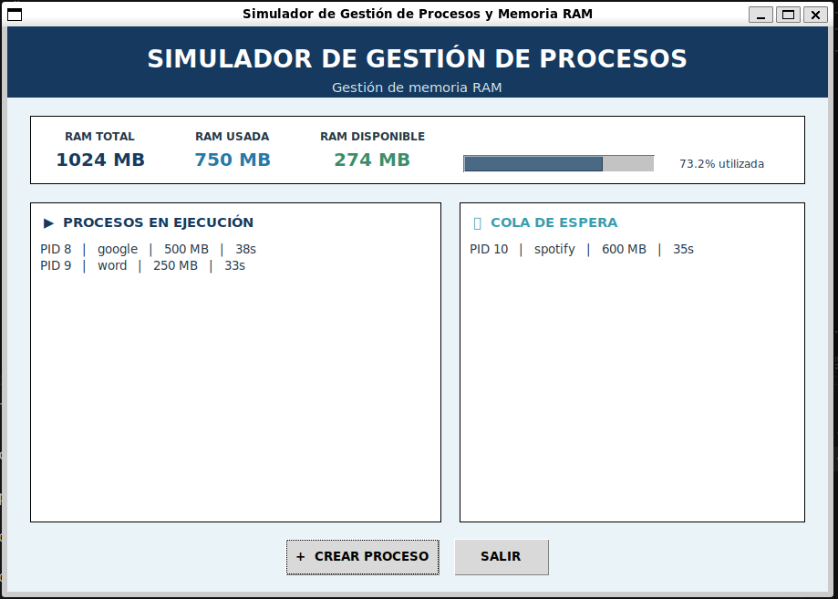

# Simulador de Gestión de Procesos y Memoria RAM

## Descripción del proyecto

Este proyecto consiste en un simulador de gestión de procesos y memoria RAM desarrollado para el curso de **Sistemas Operativos I**.

La idea principal es representar de una manera sencilla cómo un sistema operativo puede administrar la memoria disponible cuando se crean diferentes procesos. Cada proceso necesita una determinada cantidad de memoria y tiene un tiempo de ejecución. Si existe memoria suficiente, el proceso puede comenzar a ejecutarse; si no, pasa a una cola de espera hasta que haya memoria disponible.

El proyecto comenzó como un simulador por consola y posteriormente se incorporó una **interfaz gráfica**, con el objetivo de que el funcionamiento de la memoria, los procesos y la cola de espera pueda observarse de una manera más clara.

---

## Objetivo

Desarrollar un programa capaz de simular la gestión de procesos en un sistema con **1024 MB de memoria RAM**, permitiendo crear procesos, controlar la memoria utilizada, mantener en espera los procesos que no pueden ejecutarse y liberar automáticamente la memoria cuando un proceso termina.

---

## Tecnologías utilizadas

### Lenguaje

* **Python 3**

### Librerías utilizadas

* **Tkinter:** utilizada para crear la interfaz gráfica del programa.
* **threading:** permite ejecutar un hilo en segundo plano para controlar el paso del tiempo de los procesos.
* **collections.deque:** utilizada para manejar la cola de espera de los procesos.
* **time:** utilizada para controlar los intervalos de tiempo de ejecución.
* **tkinter.messagebox:** utilizada para mostrar mensajes y validaciones dentro de la interfaz.

---

## Características principales

El simulador cuenta con las siguientes funciones:

* Memoria RAM total de **1024 MB**.
* Generación automática de un **PID único** para cada proceso.
* Permite asignar un nombre a cada proceso o generarlo automáticamente.
* Permite indicar la memoria que necesita cada proceso.
* Permite establecer la duración de cada proceso en segundos.
* Permite ejecutar varios procesos mientras exista memoria disponible.
* Envía a una cola de espera los procesos que no pueden ejecutarse por falta de memoria.
* Libera automáticamente la memoria cuando un proceso termina.
* Intenta incorporar nuevamente los procesos de la cola cuando se libera memoria.
* Muestra en tiempo real la memoria total, utilizada y disponible.
* Muestra los procesos que se encuentran en ejecución.
* Muestra los procesos que se encuentran en la cola de espera.
* Cuenta con una interfaz gráfica para facilitar la interacción con el simulador.

---

## ¿Cómo funciona el simulador?

La memoria disponible inicialmente es de **1024 MB**.

Cuando se crea un proceso, se indican tres datos:

1. Nombre del proceso.
2. Memoria requerida en MB.
3. Duración en segundos.

Si la memoria disponible es suficiente, el proceso pasa directamente a ejecución y la memoria requerida se descuenta de la memoria disponible.

Si no existe suficiente memoria, el proceso se coloca en la **cola de espera**.

Mientras los procesos se encuentran en ejecución, el simulador actualiza su tiempo de duración. Cuando uno de ellos llega a cero, el proceso finaliza y la cantidad de memoria que estaba utilizando vuelve a estar disponible.

Después de liberar memoria, el simulador revisa la cola de espera para comprobar si alguno de los procesos ya puede comenzar a ejecutarse.

---

## Entorno de ejecución

El proyecto está diseñado para ejecutarse en un entorno **Linux**, específicamente en **Ubuntu o WSL (Windows Subsystem for Linux)**.

### Requisitos

* Ubuntu / WSL.
* Python 3.
* Git.
* Visual Studio Code

Para comprobar que se está utilizando Linux desde WSL se puede ejecutar:

```bash
uname -a
```

También se puede comprobar la versión de Python con:

```bash
python3 --version
```

---

## Instalación

Primero se debe clonar el repositorio:

```bash
git clone https://github.com/Yoselin-Ajcu/simulador-procesos-ram.git
```

Después se ingresa a la carpeta del proyecto:

```bash
cd simulador-procesos-ram
```

El proyecto utiliza librerías incluidas con Python, por lo que no es necesario instalar frameworks adicionales para ejecutar la aplicación.

En caso de que Tkinter no esté instalado en Ubuntu, se puede instalar con:

```bash
sudo apt install python3-tk
```

---

## Ejecución

Para iniciar el simulador se utiliza:

```bash
python3 interfaz.py
```

Al ejecutarlo se abrirá la ventana principal de la aplicación.

---

## Uso de la interfaz

La ventana principal muestra la información más importante del simulador.

### Crear un proceso

Al seleccionar **CREAR PROCESO**, se abre una ventana donde se pueden ingresar:

* Nombre del proceso.
* Memoria requerida en MB.
* Duración en segundos.

Después de ingresar los datos, se selecciona **CREAR PROCESO** para agregarlo al simulador.

### Estado de la memoria

En la parte superior de la ventana se muestra:

* RAM total.
* RAM utilizada.
* RAM disponible.
* Porcentaje de memoria utilizada.

La información se actualiza automáticamente mientras los procesos están funcionando.

### Procesos en ejecución

En esta sección se muestran los procesos que actualmente tienen memoria asignada y están ejecutándose.

Para cada proceso se muestra:

* PID.
* Nombre.
* Memoria utilizada.
* Tiempo restante.

### Cola de espera

Cuando un proceso necesita más memoria de la que se encuentra disponible, no se elimina. En su lugar, se coloca en la cola de espera.

Cuando otro proceso termina y libera memoria, el simulador vuelve a revisar la cola para determinar si alguno de los procesos puede comenzar a ejecutarse.

### Salir

El botón **SALIR** permite cerrar el simulador. Antes de cerrarlo, el programa solicita una confirmación.

---

## Estructura del proyecto

La estructura principal del proyecto es la siguiente:

```text
simulador-procesos-ram/
│
├── main.py
├── interfaz.py
├── README.md
├── .gitignore
│
└── capturas/
    ├── estado_memoria_ram.png
    └── procesos_ejecucion_cola.png
```

### `main.py`

Contiene la lógica principal del simulador. En este archivo se manejan los procesos, la memoria disponible, la cola de espera, la ejecución de los procesos y la liberación de memoria.

### `interfaz.py`

Contiene la interfaz gráfica desarrollada con Tkinter. Se encarga de mostrar la información del simulador y permitir al usuario crear procesos y observar el estado de la memoria.

### `README.md`

Contiene la documentación del proyecto, sus características, instrucciones de instalación y uso.
### Carpeta `capturas`

Contiene las imágenes utilizadas para mostrar visualmente el funcionamiento del programa.

---

## Capturas de pantalla

### Procesos en ejecución y estado de la memoria

En esta captura se puede observar los procesos que se encuentran ejecutándose y los que están cola de espera.




### Estado actual de la memoria RAM

En esta captura se muestra el estado actual de la memoria RAM.


